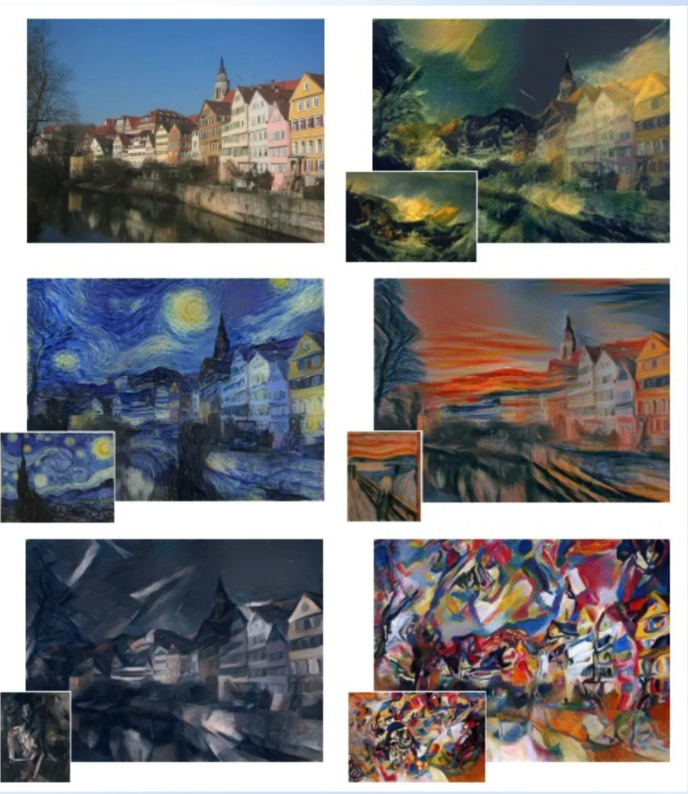

# VGG19_Style_Transfer

---------------------------------------------------
Transfer Learning is a powerful teachnique that can save a lot of time and can provide amazing results in a variaty of Applications. One of these applications is commonly reffered to as: <b>Style Transfer<b>
  
  
- Style Transfer: Deals with the process of differentiating between the image content and the image style. Where image content relates more heavily to the objects in the image and the specific layout of these objects in the given image. While image style refers to the specific style within an image. At a general level, this can refer to the basic components of an image, such as color and texture. This can also include more specific features such as the style of paint strokes or the style of the painting technique used.
  
- The game of Style Transfer is the combined contents of an image with the style of a completely different image. Effectively transferring the style of the second image to the first. The resulting image of the combined content and style is referred to as the target image. This technique can have fascinating results.

<caption>
 <u><b>Figure 1</u></b>: Example of a segmented image   
</caption>
